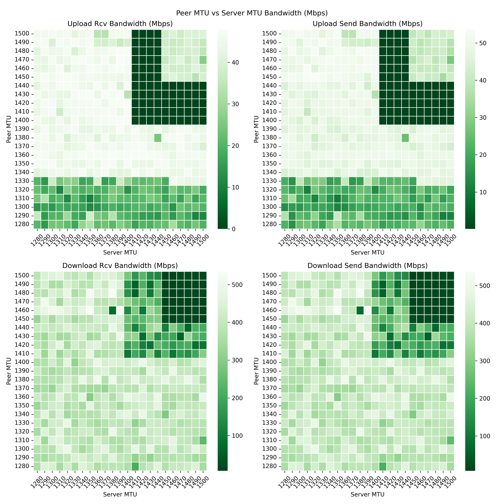

# About
A python 3 project to help find optimal MTUs for a Wireguard peer and server.

***Please read the following documentation carefully, especially the WARNING section***.


* This project offers no warranties, therefore do not use in production. Ideally trying using two VMs that are similar to your production setup.
* The project was developed and tested against a WG peer and WG server running Ubuntu 20.04. 


# Warning
***WARNING: This project contains scripts that run shell commands using root access. DO NOT USE IN PRODUCTION.***

***WARNING: This project tears down and spins up the Wireguard interface in the order of a thousand times. DO NOT USE IN PRODUCTION.***


That being said, if you're an experienced python developer, please go through the code to verify that it meets your security standards.


# Example Bandwidth Plot


# Installation

Install the following on both the WG server and WG peer
* Install `ping`
    ```bash
    # Ubuntu
    sudo apt install iputils-ping
    ```
* Install `iperf3`
    ```bash
    # Source: https://iperf.fr/iperf-download.php
    ```
* Install `sed`
    ```bash
    # Ubuntu
    sudo apt install sed
    ```
* Install `wg-quick`
    ```bash
    # Should come installed when you install Wireguard
    ```
* Install the project
    ```bash
    # Use your environment manager of choice like virtualenv or conda to pre-create an environment
    # This package has the following dependencies: pandas, matplotlib, pydantic, requests, flask
    pip install git+https://github.com/nitred/nr-wg-mtu-finder.git --upgrade
    ```

# Usage

### Prerequisites
1. Follow the installation instructions above for both WG server and WG peer
1. The project assumes that you already have a working WG installation on both the WG peer and WG server.
1. The project assumes that you already have a WG interface like `wg0`.
1. The project assumes that you already have a WG conf file like `/etc/wireguard/wg0.conf`. ***Take a backup of these files***.
1. Start the WG server script before the WG peer script

### On the WG Server
1. Let your firewall accept connections on port 5201 from IPs within your WG interface. This port is used by the iperf3 server.
   ```text
   # Replace 10.2.0.0/24 with your interface's IP range
   ufw allow proto tcp from 10.2.0.0/24 to any port 5201
   ```
1. Let your firewall accept connections on port 5000 from IPs within your WG interface. This port is used by the flask server.
   ```text
   # Replace 10.2.0.0/24 with your interface's IP range
   ufw allow proto tcp from 10.2.0.0/24 to any port 5000
   ```
1. Add the MTU setting to the WG conf file i.e. `/etc/wireguard/wg0.conf`. Choose any random MTU, it will be replaced by the script anyway:
    ```text
    [Interface]
    ...
    MTU = 1420  # <----- ADD THIS LINE IF NOT ALREADY EXISTS
        
    [Peer]
    ...
    ```
1. Start the server script with the following command.
    ```bash
    # Example: The script cycles peer MTUs from 1280 to 1290 in steps of 2
    nr-wg-mtu-finder --mode server --mtu-min 1280 --mtu-max 1290 --mtu-step 2 --server-ip 10.2.0.1
    ```

### On the WG Peer
1. Add the MTU setting to the WG conf file i.e. `/etc/wireguard/wg0.conf`. Choose any random MTU, it will be replaced by the script anyway:
    ```text
    [Interface]
    ...
    MTU = 1420  # <----- ADD THIS LINE IF NOT ALREADY EXISTS
        
    [Peer]
    ...
    ```
1. Start the server script with the following command.
    ```bash
    # Example: The script cycles peer MTUs from 1280 to 1290 in steps of 2
    nr-wg-mtu-finder --mode peer --mtu-min 1280 --mtu-max 1290 --mtu-step 2 --server-ip 10.2.0.1
    ```

# How it works?

* Two python scripts need to be running simultaneously, one of the WG server and one on the WG peer. Let's call them *server script* and *peer script*.
* The both scripts use `subprocess.Popen` to run shell commands. The following commands are used and expected to be pre-installed if not already available:
    * `ping`
    * `iperf3`
    * `wg-quick`
    * `sed`
* The server script also runs a `flask` server and the peer script uses `requests` to communicate with the flask server.


### How does the server script work?
1. The flow for the server script is defined in the method `MTUFinder.run_server_mode()`.
1. First, a flask server called a `sync_server` is run is the background on a separate process.
    * The `sync_server's` listens for requests and commands from the peer script so that they can synchronize with each other.
    * The peer script waits for the `sync_server` to be available before running any upload or download tests.
    * The peer scripts get the status and MTU of the server script from the `sync_server`.
    * The peer script tells the `sync_server` that it is done with its cycling through all of its MTUs and is ready for the server script to change its MTU so that it can start a fresh cycle.
    * The `sync_server` informs the peer script that the server script is finished with cycling through all MTUs and that it is going to shut itself down. The peer script uses this signal to shut itself down as well.
1. When the server script receives an `INTIALIZE` signal, it runs the following shell commands
    * First, terminate an `iperf3` server process if it is already running.
    * Spin down the WG interface
        ```
        wg-quick down wg0
        ```
    * Replace the MTU in the WG conf file with the next MTU in the list
        ```
        # 1421 is the new MTU
        sed -i s/MTU.*/MTU = 1421/ /etc/wireguard/wg0.conf
        ```
    * Spin up the WG interface
        ```
        wg-quick up wg0
        ```
    * Run iperf3 in server mode
        ```
        iperf3 -s
        ```
1. If the server has finishing cycling through all of its MTUs and then receives a request from peer script that it is ready for a new cycle, then the server sends a `SHUTDOWN` signal to the peer script via the `sync_server`. 


### How does the server script work?
* On start, the peer script checks if the `sync_server` is reachable. Once it is reachable, it sends a `peer/ready` request to the server script.
* The peer script then waits for the `iperf3` server to start on the server side. Once it recognizes that the iperf3 server has started, and then the peer script starts cycling through each of its MTUs.
    * For each MTU, the peer script runs an upload and download test using the following command
        ```
        # Upload test
        iperf3 -c 10.2.0.1 -J -t 5 -i 5
        # Download test
        iperf3 -c 10.2.0.1 -J -t 5 -i 5 -R
        ```
    * After each download and upload test, the peer script parses the output and stores the bandwidth results in a bandwidth log file.
* Once the peer script is finished cycling through all of its MTU, it sends another `peer/ready` request to the server script and restarts the whole process again with the next server MTU.
* If the server script is finished cycling through all of its MTUs, then it sends a `SHUTDOWN` signal to the peer script as a reply to the `peer/ready` request. The server shuts down after a short delay as does the peer script.
* Finall the user can check the bandwidth log file to see the results.

## License
MIT


